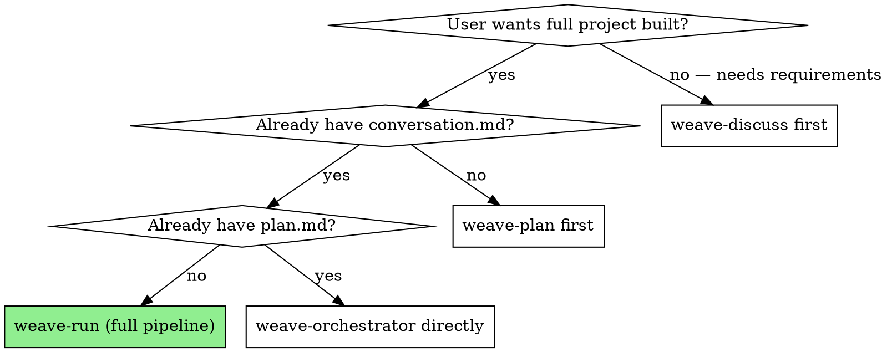

# CortexWeave — Full Pipeline

Runs all 5 phases using specialized agents: Discussion → Planning → Implementation → QA → Report.

## When to Use



## Step 1 — Gather Context

Ask the user (all 3 required before proceeding):
1. What are you building? (problem + who uses it)
2. Tech stack preference? (or "let the architect decide")
3. Output workspace path? (default: `./output/`)

## Step 2 — Confirm

Show summary and wait for "yes" before launching:

```
Project: [summary]
Stack:   [preference or "auto"]
Output:  [path]

Phases: Discussion ✅ → Planning → Implementation → QA → Report
Start?
```

## Step 3 — Run Phases in Order

Delegate to agents sequentially. Show one-line status after each phase completes. If a phase fails 3 times, surface the error and ask the user: retry / skip / abort.

## Step 4 — Final Summary

Report: location of `reports/README.md` and `reports/doc.md`, QA pass/fail count, any architecture violations.

## Rules

- Never skip QA even if asked
- Warn user when token budget hits 80%
- Never silently retry an agent failure more than 3 times
